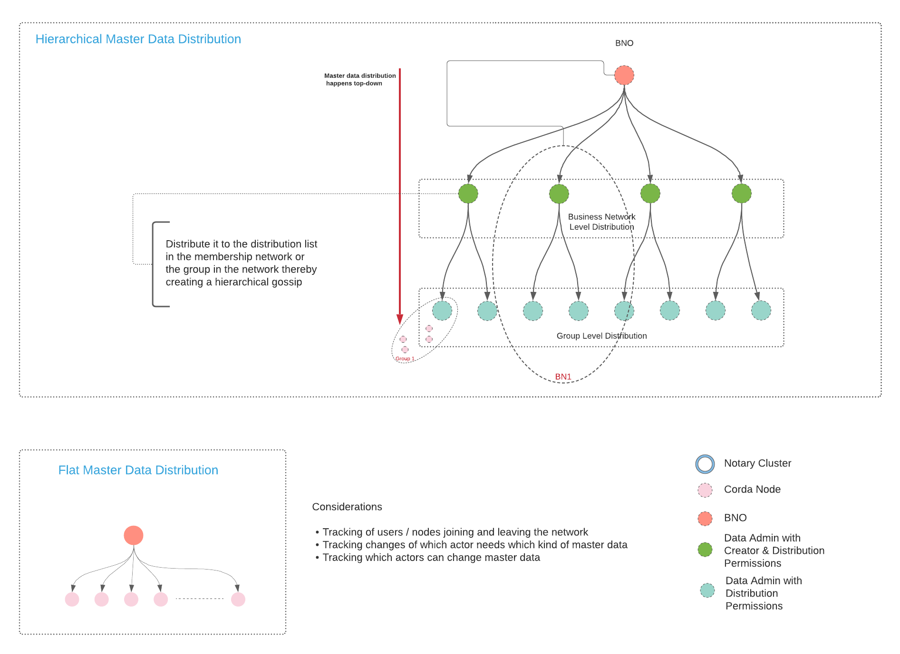

## 2. Top-Down Data distribution in a Business Network



### On-boarding
From the shell of Party A (i.e. BNO in this case), run the following
```shell
flow start MembershipFlows$CreateMyNetworkFlow defaultGroupName: myGroup001
```
You will be presented with an output like the below which contains the created `networkId` and the unique Membership state identifier (`membershipId`) for the BNO.

```
Flow completed with result: Created Network with ID: 00f217f9-f6fb-4db8-8ccc-e2a638e86c24, membershipId: 3606e91e-d956-47f3-a7a3-b5acebc79874, and role BNO
```

Next we have to onboard other participants in the network. These participants can be regular members or members with Data administration permissions. There are two types of permissions in this example that a member might have with respect to data. The mapping is shown below.

|Role|Permissions|Party in this example|
|----|-----------|---------------------|
|BNORole|CAN_MODIFY_GROUPS,CAN_MODIFY_BUSINESS_IDENTITY, CAN_MODIFY_ROLE, CAN_REVOKE_MEMBERSHIP, CAN_SUSPEND_MEMBERSHIP, CAN_ACTIVATE_MEMBERSHIP|PartyA|
|DataAdminRole|CAN_DISTRIBUTE_DATA, CAN_MANAGE_DATA|PartyB|
|No Role|-|PartyC|

> Note: A member with `BNORole` (with `AdminPermission`) cannot hold `DataAdminRole` at the same time.

We need to onboard PartyB to be the Data Admin for our Business network.

From the shell of PartyA, execute the following:

```shell
flow start OnboardMyNetworkParticipant networkId: <Network ID>, onboardedParty: PartyB
```

You should be presented with an output:

```shell
Onboarded PartyB on network 00f217f9-f6fb-4db8-8ccc-e2a638e86c24 with membershipId: f13f676d-c7c4-44ac-acfe-e97cc75f1e18
```

---
> Note you can also make use of the `RequestMyNetworkMembership` flow to allow PartyB to request membership to a network.

From the shell of PartyB, run

```shell
flow start RequestMyNetworkMembership networkId: <Network ID>
```

From the shell of PartyA (BNO), approve the request

```shell
flow start ApproveMyNetworkMembership membershipId: <Membership ID of the requested participant>
```
---

Check the roles of participants before we proceed to the next step:

```shell
flow start QueryRolesForMembershipFlow membershipId: <Membership ID of BNO>
```
The above should yield a result like: `Flow completed with result: BNO`

```shell
flow start QueryRolesForMembershipFlow membershipId: <Membership ID of PartyB>
```
The above should yield a result like: `Flow completed with result: `

This means that PartyB does not have any roles yet. Now let us assign the Data admin permissions to PartyB

```shell
flow start AssignDataAdminRoleFlow membershipId: <Membership ID of PartyB>
```

Querying the role of PartyB

```shell
flow start QueryRolesForMembershipFlow membershipId: <Membership ID of PartyB>
```
should now yield the following result `Flow completed with result: DataAdmin`


From the shell of PartyA, execute the following

```shell
flow start OnboardMyNetworkParticipant networkId: <NetworkID>, onboardedParty: PartyC
```

You should be presented with an output:

```shell
Onboarded PartyC on network 00f217f9-f6fb-4db8-8ccc-e2a638e86c24 with membershipId: 42087884-e3ce-4731-9d3c-36b1595784d2
```


### Group Creation

From the shell of PartyA, execute the following:

```shell
flow start CreateMyGroupFlow networkId: 00f217f9-f6fb-4db8-8ccc-e2a638e86c24, groupName: data-grp-001, membershipIds:["3606e91e-d956-47f3-a7a3-b5acebc79874", "f13f676d-c7c4-44ac-acfe-e97cc75f1e18", "42087884-e3ce-4731-9d3c-36b1595784d2"]
```
You should be presented with a group id

```
Flow completed with result: Group created with id: ba1b9ee5-e2e3-4c81-9005-3f473e21692b
```

### Data Creation

Now that we have onboarded the participants with the roles, let us create some data from PartyB (Data Admin) and see if they are distributed to the participants


```shell
flow start CreateDataFlow data: "Hello Sample Data", groupIds: [<Group ID>]
```

should yield a result like

```
Flow completed with result: Data with id: bf88d94d-283f-4f7b-85b0-ea6d0e517826 created and distributed to groups: ba1b9ee5-e2e3-4c81-9005-3f473e21692b, TxId: 6DE8BE807D3E7C94ECA09007E29131FF708C0E44920FDF4A1BF3086F1DB868B1
```

### Query Data

From each of PartyA (BNO), PartyB (DataAdmin), PartyC execute the following.

```shell
run vaultQuery contractStateType: com.r3.demo.datadistribution.contracts.GroupDataAssociationState
```

From PartyB you should get a result as below.

```shell
states:
- state:
    data: !<com.r3.demo.datadistribution.contracts.GroupDataAssociationState>
      linearId:
        externalId: null
        id: "bf88d94d-283f-4f7b-85b0-ea6d0e517826"
      value: "Hello Sample Data"
      associatedGroupStates:
      - pointer:
          externalId: null
          id: "ba1b9ee5-e2e3-4c81-9005-3f473e21692b"     # <---- Group state reference
        type: "net.corda.bn.states.GroupState"
        isResolved: true
      participants:
      - "O=PartyB, L=London, C=GB"    # <---- PartyB is the participant since it has Data Admin Role
    contract: "com.r3.demo.datadistribution.contracts.GroupDataAssociationContract"
    notary: "O=Notary, L=London, C=GB"
    encumbrance: null
    constraint: !<net.corda.core.contracts.SignatureAttachmentConstraint>
      key: "aSq9DsNNvGhYxYyqA9wd2eduEAZ5AXWgJTbTEw3G5d2maAq8vtLE4kZHgCs5jcB1N31cx1hpsLeqG2ngSysVHqcXhbNts6SkRWDaV7xNcr6MtcbufGUchxredBb6"
  ref:
    txhash: "6DE8BE807D3E7C94ECA09007E29131FF708C0E44920FDF4A1BF3086F1DB868B1"
    index: 0
statesMetadata:
- ref:
    txhash: "6DE8BE807D3E7C94ECA09007E29131FF708C0E44920FDF4A1BF3086F1DB868B1"
    index: 0
  contractStateClassName: "com.r3.demo.datadistribution.contracts.GroupDataAssociationState"
  recordedTime: "2021-09-21T12:24:38.003Z"
  consumedTime: null
  status: "UNCONSUMED"
  notary: "O=Notary, L=London, C=GB"
  lockId: null
  lockUpdateTime: null
  relevancyStatus: "RELEVANT"  # <---- PartyB is the Data Admin, and PartyA and PartyC are observers
  constraintInfo:
    constraint:
      key: "aSq9DsNNvGhYxYyqA9wd2eduEAZ5AXWgJTbTEw3G5d2maAq8vtLE4kZHgCs5jcB1N31cx1hpsLeqG2ngSysVHqcXhbNts6SkRWDaV7xNcr6MtcbufGUchxredBb6"
totalStatesAvailable: -1
stateTypes: "UNCONSUMED"
otherResults: []
```

From PartyA and PartyC you should get the same result but with the difference in relevancy as below.

```shell
states:
- state:
    data: !<com.r3.demo.datadistribution.contracts.GroupDataAssociationState>
      linearId:
        externalId: null
        id: "bf88d94d-283f-4f7b-85b0-ea6d0e517826"
      value: "Hello Sample Data"
      associatedGroupStates:
      - pointer:
          externalId: null
          id: "2e064ba9-6959-4d54-b840-025535de4eb0"
        type: "net.corda.bn.states.GroupState"
        isResolved: true
      participants:
      - "O=PartyB, L=London, C=GB"
    contract: "com.r3.demo.datadistribution.contracts.GroupDataAssociationContract"
    notary: "O=Notary, L=London, C=GB"
    encumbrance: null
    constraint: !<net.corda.core.contracts.SignatureAttachmentConstraint>
      key: "aSq9DsNNvGhYxYyqA9wd2eduEAZ5AXWgJTbTEw3G5d2maAq8vtLE4kZHgCs5jcB1N31cx1hpsLeqG2ngSysVHqcXhbNts6SkRWDaV7xNcr6MtcbufGUchxredBb6"
  ref:
    txhash: "6DE8BE807D3E7C94ECA09007E29131FF708C0E44920FDF4A1BF3086F1DB868B1"
    index: 0
statesMetadata:
- ref:
    txhash: "6DE8BE807D3E7C94ECA09007E29131FF708C0E44920FDF4A1BF3086F1DB868B1"
    index: 0
  contractStateClassName: "com.r3.demo.datadistribution.contracts.GroupDataAssociationState"
  recordedTime: "2021-09-21T12:24:38.226Z"
  consumedTime: null
  status: "UNCONSUMED"
  notary: "O=Notary, L=London, C=GB"
  lockId: null
  lockUpdateTime: null
  relevancyStatus: "NOT_RELEVANT" # <---- PartyB is the participant, hence this state is not relevant
  constraintInfo:
    constraint:
      key: "aSq9DsNNvGhYxYyqA9wd2eduEAZ5AXWgJTbTEw3G5d2maAq8vtLE4kZHgCs5jcB1N31cx1hpsLeqG2ngSysVHqcXhbNts6SkRWDaV7xNcr6MtcbufGUchxredBb6"
totalStatesAvailable: -1
stateTypes: "UNCONSUMED"
otherResults: []
```

## 3. Using Distributed and linked data with Group

In the previous example, we have seen that the data associated with group is distributed to all group participants. Parties who do not possess the `DataAdminRole` in the group stores the `GroupDataAssociationState` as `NOT_RELEVANT` (PartyA and PartyC) while those who have `DataAdminRole` store it as `RELEVANT` (PartyB).

In this example, we will create another instance of `GroupDataAssociationState` with a value of 10 (as string). This will act as a upper limit on the amount that a party can owe to another using the IoU state contract. We will invoke the IoU flow with the reference to this newly created `GroupDataAssociationState` state.

From the shell of PartyB issue the following command:

```shell
flow start CreateDataFlow data: "10", groupIds: ["<Group ID created in the above example>"]
```
should yield
```shell
Flow completed with result: Data with id: d5bb920e-893e-40fa-b0b7-70065cd1c8d5 created and distributed to groups: ba1b9ee5-e2e3-4c81-9005-3f473e21692b, TxId: 4E46F127F3E16A12ABEBB065C4862B73641F875D29E220197FAC06BEF573B69C
```

We have created an association between the value 10 with the group where all three participants are a part.

Now copy this data id and navigate to the shell of PartyC and execute the following:

```shell
flow start IOUFlows$Initiator iouValue: 12, otherParty: PartyA, groupDataAssociationRef: d5bb920e-893e-40fa-b0b7-70065cd1c8d5
```
You should see the following error.

```shell
☠   Contract verification failed: Failed requirement: The IoU cannot have a value more than the configured maxIouValue in GroupDataAssociationState, contract: com.r3.demo.datadistribution.contracts.IOUContract, transaction: 0F4216E756EF1884E0CAD98099EEA4DD7C89DE4B77E26A81BDF6AC9D8D1E2C81
	☠   java.lang.IllegalArgumentException: Failed requirement: The IoU cannot have a value more than the configured maxIouValue in GroupDataAssociationState
```

Now retry with a value equal to or lower than 10 (the configured value in the `GroupDataAssociationState`)


```shell
flow start IOUFlows$Initiator iouValue: 9, otherParty: PartyA, groupDataAssociationRef: d5bb920e-893e-40fa-b0b7-70065cd1c8d5
```

The transaction should succeed with the following message.

```shell
Flow completed with result: SignedTransaction(id=62684D3C408DAE6AB351BFA6046BA3F218A33453643D339002AAF627813A3864)
```
Try the example with the following additional scenario: Using a different id for `groupDataAssociationRef` that belongs to another group of non-existent


